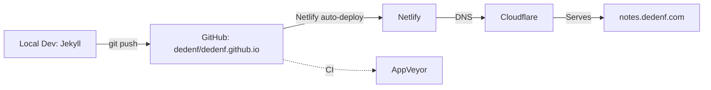

# Readme

Hello....

---

## Analysis

### Overview

This is **Deden Fathurahman's personal blog/notes site**, hosted at **[notes.dedenf.com](https://notes.dedenf.com)**. It's a static site built with **Jekyll** (Ruby-based static site generator), themed with **Pixyll** (a minimal Jekyll theme), and deployed via **Netlify** with **Cloudflare** for DNS/security.

### Tech Stack

| Component | Technology |
|---|---|
| **Static Site Generator** | [Jekyll](https://jekyllrb.com/) (Ruby) |
| **Theme** | Pixyll (customized extensively) |
| **Markdown Parser** | kramdown + GFM |
| **Hosting** | Netlify (`netlify.toml`) |
| **DNS / Security** | Cloudflare |
| **Custom Domain** | `notes.dedenf.com` |
| **CI** | AppVeyor (`appveyor.yml`) |
| **Comments (disabled)** | Disqus & Facebook Comments (both configured but currently disabled) |

### Key Configuration (`_config.yml`)

- **Title**: "Deden Fathurahman's notes"
- **Description**: Blog covers tech, financial, life topics
- **Permalink format**: `/:year/:month/:title`
- **Pagination**: 5 posts per page
- **Plugins**: `jekyll-paginate`, `jekyll-sitemap`, `jekyll/tagging`
- **MathJax**: Enabled (for rendering LaTeX math)
- **Analytics**: Google Analytics & Google Tag Manager configured but left blank (disabled)
- **Languages**: Mixed English & Indonesian (Bahasa Indonesia)

### Content

#### Posts: ~360+ posts spanning 2011–2026

The blog goes back over a decade with a diverse range of topics:

- **Tech/Engineering**: Kubernetes, Docker/Podman, Git, tmux, Vagrant, Nginx, Jekyll workflows, browsers (Firefox, Chrome, Arc, Zen), macOS, Windows, Linux
- **Finance/Investing**: Indonesian mutual funds (reksadana), digital banking, budget apps, stock/obligation investing, comparisons of platforms (Bareksa, Tanamduit, Investree, Bibit, Ajaib)
- **Personal/Life**: Parenting, hijrah (religious reflection), gratitude, procrastination, loneliness, conference fatigue, nostalgia
- **Media/Podcasts**: Podcast recommendations, Spotify reviews, Google Podcasts RIP, music playlists, book reviews
- **Society**: Privacy/security, fake news, conspiracy theories, COVID-19 reflections, filter bubbles, cognitive biases

Notable recurring series:
- **"Daily Bite"** / **"Daily Found"** — curated links and quick thoughts
- **"Seputar Finansial"** — personal finance series in Indonesian
- **"Reading List"** — periodic book/article roundups

### Pages

| Page | Purpose |
|---|---|
| `index.html` | Homepage with paginated posts |
| `about.md` | Bio, blog history, contact info |
| `contact.html` | Contact form |
| `archives.md` | Post archives |
| `now.md` | "Now" page (what the author is up to) |
| `colophon.md` | Technical details about the site |
| `thanks.md` | Thank-you page |
| `feed.md` / `feed.xml` | RSS/Atom feeds |
| `my-reading.html` | Reading list page |
| `404.md` | Custom 404 page |

### Design & Theme

The site uses **Pixyll**, a minimal Jekyll theme with extensive custom CSS via Sass:

- **Layouts**: `default.html`, `post.html`, `page.html`, `link.html`, `tag_page.html`, `archives.html`, `center.html`, `feed.xml`
- **Sass framework**: Basscss (a lightweight CSS toolkit) + custom styles
- **SCSS files** cover: typography, posts, header, footer, social icons, code blocks, blockquotes, pagination, forms, gists, animations, media queries, tables
- **Responsive**: Uses `p-responsive` and `wrap` classes
- **MathJax**: Enabled for mathematical notation
- **Service Worker** (`sw.js`): Basic PWA caching for fonts (Google Fonts, Bootstrap CDN) and the homepage

### Infrastructure & Deployment

- **CNAME**: `notes.dedenf.com`
- **Netlify config** (`netlify.toml`): Sets timezone to Asia/Jakarta, aggressive cache-control headers (`no-cache, no-store, must-revalidate`)
- **No build command** in netlify.toml — Jekyll builds are handled by Netlify's native Jekyll support
- **AppVeyor** configured for CI

### Notable Observations

1. **Exposed API Secret**: `_config.yml` line 170 contains `apisecret` with a plaintext value that should be removed or environment-variable-ized.
2. **Disabled Features**: Comments (Disqus/Facebook), related posts, sharing icons, and analytics are all configured but disabled in the config.
3. **Jekyll Version Pin**: `.ruby-version` pins the Ruby version for the project.
4. **Rich tagging system**: Posts use `jekyll/tagging` plugin with a dedicated `/tag/` directory and `tag_page` layout.
5. **Active author**: The most recent posts are from 2026, showing this is still actively maintained.
6. **Mixed language content**: Posts use both English and Indonesian, reflecting the author's bilingual readership.

### Project Health

- **Active**: Yes — latest posts are very recent (2026)
- **Long-running**: Blogging since 2006, imported from various platforms (Blogger, Blogsome, Posterous, WordPress)
- **Well-organized**: Clean separation of layouts, includes, sass, posts, and pages
- **Feature-rich**: MathJax, tags, pagination, RSS, sitemap, service worker, PWA caching